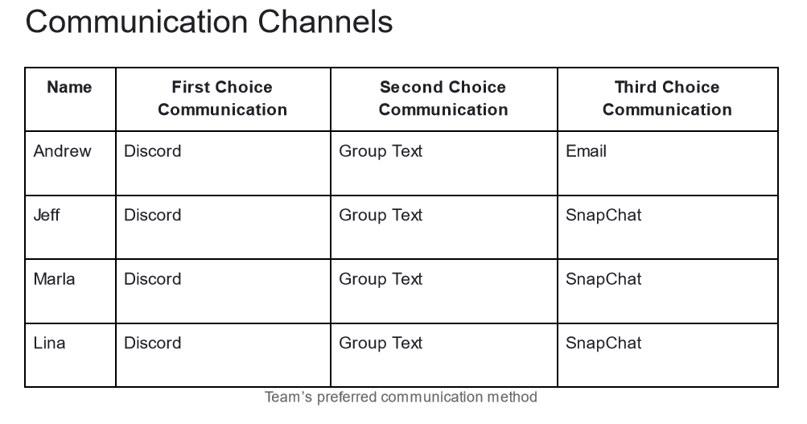
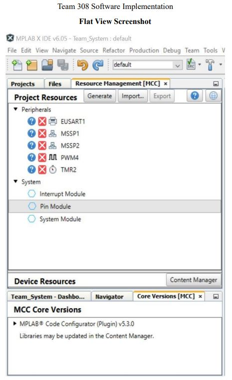
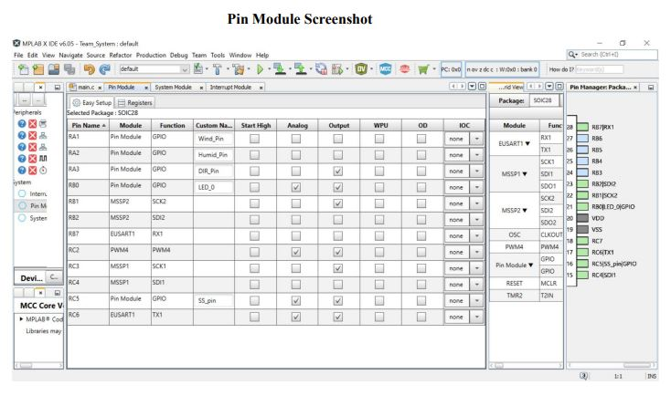
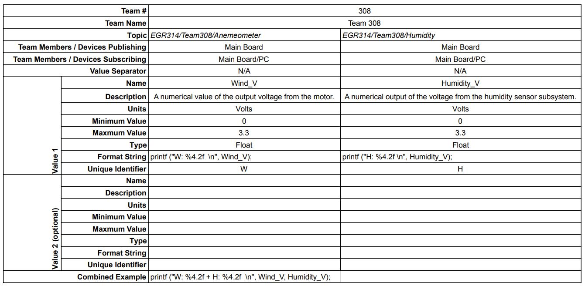

<h1>Appendix</h1>

A: **Team Organization** 
B: **Bill of Materials** 
C: **MCC and main.c** 
D: **MQTT Topic Table** 

<h2>Appendix A: Team Organization</h2>

**Communication Procedures**

Our team will communicate primarily through Discord on a regular basis. It will be expected for team members to check for updates daily. In the absence of a response over Discord, we will send messages with a group text. 
If any team member personally receives correspondence from the instructor relating to the group, they will be responsible for notifying the rest of the team. This will primarily be done using Discord, and main information that is obtained through email will be forwarded and/ or carbon copied. 
Our team members’ phone numbers and emails can be found in the chart below and our team discord has been made. Everyone has been added, but if there are difficulties here is the invite link: https://discord.gg/97bPcvWd
   
  
**Meeting Coordination**

We will have scheduled meetings put on a shared team calendar. Meetings will be added or changed after everyone agrees on it. If things get brought up and one or more people cannot make the scheduled times, we will set up the meeting on zoom and/ or communicate the discussion and project needs in meeting notes shared on the discord and google drive. We all agree that everyone has lives and unexpected circumstances. Meetings will start 10 minutes after the scheduled time. Anyone not in attendance will be reminded. 
Since the class, and team, requires hands-on work, we will be meeting in person for all of our meetings. If needed members should be able to propose new procedures if needed.
  
  
**Team Coordination**

Our team will use discord to verify that assignments are submitted before the deadlines and that each team member approves of the assignments. If team members do not have the required knowledge or skills required for each assignment we will discuss it within the team and if that does not work we will talk to the professor. Our team will meet through discord to make sure that we distribute the work equally and that each team member knows what they are assigned to. 
  
  

 
 

<h2>Appendix B: Bill of Materials</h2>

 

| Name          | Part#         |    Quantity   |   Unit Price  | Total Price   |
| ------------- | ------------- | ------------- | ------------- | ------------- |
|General Operational Aplifier		|BD1321G-TR				|3	|$0.69	|$ 2.07|	
|DC Motor					|505-AD8630ARZ-ND			|2	|$3.86 	|$ 7.72|
|Motor Driver				|IFX9201SGAUMA1	 		|4	|$4.88 	|$ 19.52| 
|Switching Voltage Regulator		|AP63203WU-7			|5	|$0.80 	|$ 4.00 |
|Microcontroller				|PIC18LF27K40-I/SO		|3	|$2.39 	|$ 7.17 |
|330k resistor				|RMCF2512JT330K			|10	|$0.23 	|$ 2.30 |
|Humidty Sensor				|HIH-5030-001			|3	|$27.04	|$ 81.12| 
|68k resistor 				|PFC-W1206LF-03-6812-B		|8	|$1.02	|$ 8.18 |
|Analog to Digital Converter		|LTC2361ITS8			|4	|$6.63	|$ 26.52|
|Analog to Digital Converter		|MCP3201-CI/SN			|4	|$3.20	|$ 12.80|
|Capacitor 0.1				|CL05A104KA5NNNC			|100	|$0.0045 	|$ 0.45 |
|				|			|	|Subtotal	|$ 171.85 |
|				|			|	|Tax	|$ 1.46 |
|				|			|	|Grand Total	|$ 173.31 |

<h2>Appendix C: MCC and main.c</h2>
   
Flat View

   

    
   
Pin Module

   

    
   
Main.c

   <code>
   
#include "mcc_generated_files/mcc.h"
#pragma LVP = ON
/*
                         Main application
 */

uint8_t data1;
uint8_t data12;
int ii;
float value;

bool loop = true;

void EUSART1intrrupt(void){
    EUSART1_Receive_ISR();

    if(EUSART1_is_rx_ready()){
        data1 = EUSART1_Read();
        data12 = EUSART1_Read();
        while(loop){
            if(EUSART1_is_tx_ready()){
                loop = false;
            }
        }
        loop = true;
        EUSART1_Write(data1);
        EUSART1_Write(data12);
        while(loop){
            if(EUSART1_is_tx_done()){
                loop = false;
            }
        }
    }
    
    LED_0_Toggle();
}

void main(void)
{
    volatile uint8_t rxData;
    uint8_t humid;
    uint8_t wind;
    int wind_V;
    int humid_V;
    // Initialize the device
    SYSTEM_Initialize();
    TMR2_Initialize();
    TMR2_Start();
    SPI1_Initialize();
    SPI2_Initialize();
    EUSART1_Initialize();
    PWM4_Initialize();
    
    // If using interrupts in PIC18 High/Low Priority Mode you need to enable the Global High and Low Interrupts
    // If using interrupts in PIC Mid-Range Compatibility Mode you need to enable the Global and Peripheral Interrupts
    // Use the following macros to:

    // Enable the Global Interrupts
    INTERRUPT_GlobalInterruptEnable();

    // Disable the Global Interrupts
    //INTERRUPT_GlobalInterruptDisable();

    // Enable the Peripheral Interrupts
    INTERRUPT_PeripheralInterruptEnable();

    // Disable the Peripheral Interrupts
    //INTERRUPT_PeripheralInterruptDisable();
    
    EUSART1_SetRxInterruptHandler(EUSART1intrrupt);

    while (1)
    {
        wind_V = Wind_Pin_GetValue();
        humid_V = Humid_Pin_GetValue();
        
        if(wind_V && humid_V>0){
            if(wind_V>3.17){
                SS_pin_SetHigh();
                DIR_Pin_SetHigh();
            }else{
                SS_pin_SetHigh();
                DIR_Pin_SetLow();
            }
        }else{
                SS_pin_SetHigh();
        }
        
        // Add your application code
        wind = SPI1_ReadByte();
        
        humid = SPI2_ReadByte();
        // Logic to echo received data
            if(EUSART1_is_rx_ready())
            {
                rxData = EUSART1_Read();
                if(EUSART1_is_tx_ready())
                {
                    EUSART1_Write(rxData);
                }
            }
        
            uint8_t dir1 = 0b11001111;
            uint8_t dir2 = 0b11001101;
            uint8_t receive;

        SPI1_Open(SPI1_DEFAULT);
        SS_pin_SetLow();
        printf("Send: %u\r\n",dir1);

        receive = SPI1_ExchangeByte(dir1);
        printf("Receive: %u\r\n",receive);
        SS_pin_SetHigh();
        SPI1_Close();

        

        SPI1_Open(SPI1_DEFAULT);
        SS_pin_SetLow();
        printf("Send: %u\r\n",dir2);

        receive = SPI1_ExchangeByte(dir2);
        printf("Receive: %u\r\n",receive);
        SS_pin_SetHigh();
        SPI1_Close();
        
        if(ii>=100){
            ii=0;
        }
        value= (float) ii/10;
        printf("W: %u + H: %u  \r\n", wind, humid);
        
        
    }
}
   </code>
   

 

<h2>Appendix D: MQTT Topic Table</h2>
   
Topic Table

   

