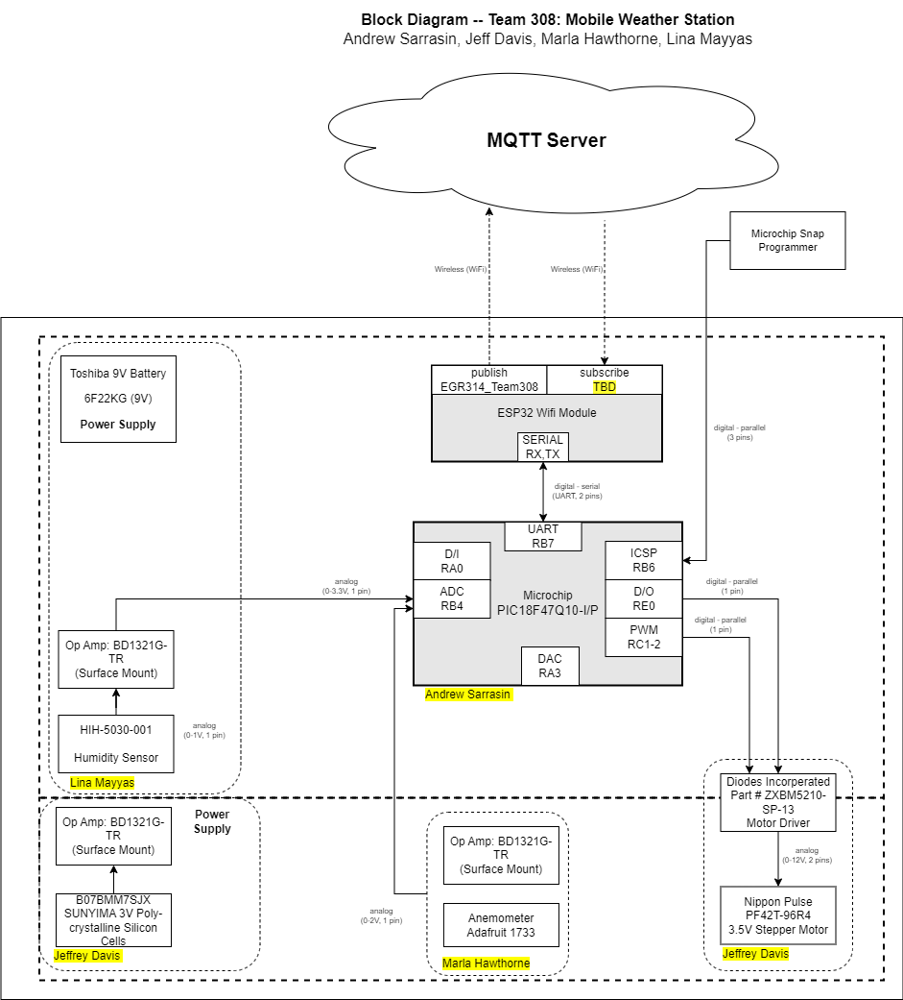

<h1><b>Block Diagram</b></h1>
 
<h2><b>Block Diagram</b></h2>
  
We needed to orginize and assin pins to subsystems before we finalize a PCB or order parts. Here is the rough layout of the components and systems. Highlighted are the 
names of the people in charge of the subsystems. This also maps out pins we can use for our subsystems and pins used to test.

 
<h2><b>Varification table</b></h2>
  

 
