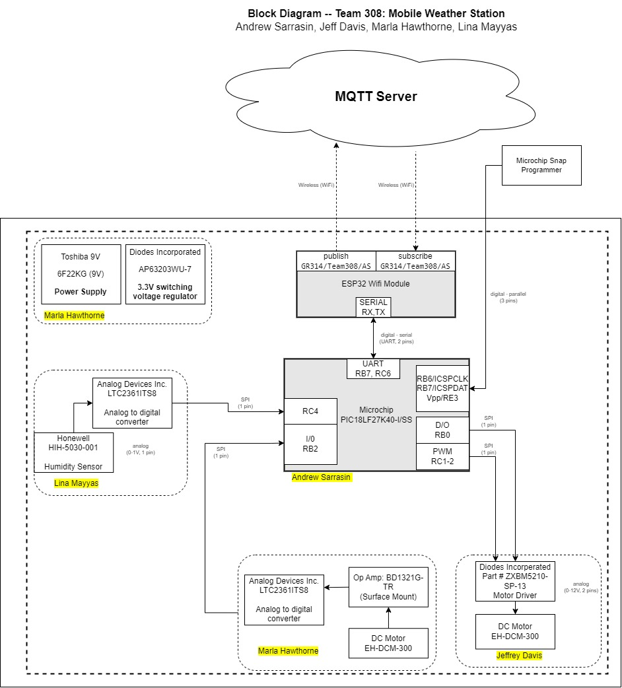

<h1><b>Block Diagram</b></h1>
 

Our team realized the need to categorize and assign pins to subsystems before finalizing the printed circuit board (PCB) or placing a part order. To do this, we created a rough overview of the systems and components with the names of the team members who were in charge of each subsystem underlined. The pins that we can use for our subsystems as well as the pins set aside for testing are also shown on this layout. We were able to make sure that each subsystem was effectively connected to the microcontroller thanks to this careful method, which allowed the system to run smoothly and productively. 
  

 

