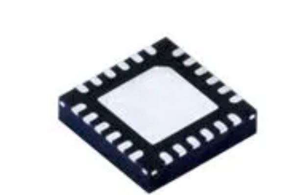

<h1>Component Selection</h1>

 <h3>Op Amp</h3>

<table>
<colgroup>
<col style="width: 20%" />
<col style="width: 20%" />
<col style="width: 20%" />
</colgroup>
<thead>
<tr class="header">
<th><strong>Solution</strong></th>
<th><strong>Pros</strong></th>
<th><strong>Cons</strong></th>
</tr>
<tr class="odd">
<th>

Op Amp.

Part <strong>No.</strong>

BD1321G-TR

<strong>Price</strong>: $ 0.69 Each

<a href="https://www.digikey.com/en/products/detail/rohm-semiconductor/BD1321G-TR/5720856?s=N4IgTCBcDaIEIBECMBmMSDiBaAKgJRAF0BfIA"><u>Link</u></a>
</th>
<th><ul>
<li><blockquote>

Surface mount is in line with class requirements

</blockquote></li>
<li><blockquote>

General purpose so we can potentially use it for other things

</blockquote></li>
<li><blockquote>

Range of acceptable voltage already includes 3.3V

</blockquote></li>
</ul></th>
<th><ul>
<li><blockquote>

Relatively low temperature range (hard to solder)

</blockquote></li>
</ul></th>
</tr>
<tr class="header">
<th>

Op Amp

Part <strong>No.</strong>

2156-OPA234E-ND

<strong>Price</strong>: $ 1.00 Each

<a href="https://www.digikey.com/en/products/detail/rochester-electronics-llc/OPA234E/12602361"><u>Link</u></a>
</th>
<th><ul>
<li><blockquote>

Has an extremely large voltage range (2.7-36V)

</blockquote></li>
<li><blockquote>

Durable in extreme temperature and moisture.

</blockquote></li>
<li><blockquote>

Does not require much supply current

</blockquote></li>
</ul></th>
<th><ul>
<li><blockquote>

Can only be bought in bulk (100+)

</blockquote></li>
</ul></th>
</tr>
<tr class="odd">
<th>

Op Amp

Part <strong>No.</strong> 505-AD8630ARZ-ND

<strong>Price</strong>:$ 9.21 Each

<a href="https://www.digikey.com/en/products/detail/analog-devices-inc/AD8630ARZ/998043"><u>Link</u></a>
</th>
<th><ul>
<li><blockquote>

Zero-Drift OpAmp minimizes input offset voltage.

</blockquote></li>
<li><blockquote>

Durable in extreme temperature and moisture.

</blockquote></li>

</ul></th>
<th><ul>
<li><blockquote>

Price is much higher than other available OpAmps

</blockquote></li>
</ul></th>
</tr>
</thead>
<tbody>
</tbody>
</table>

**Choice:** <a href="https://github.com/egr314-team308/egr314-team308.github.io/blob/main/CompSelectApp.md#opamp-bd1321g-tr"><u>BD1321G-TR</u></a>

**Rationale:** Our team chose this OpAmp because it meets class requirements and is able to be surface mounted, it is a general person OpAmp which means our team could use it for multiple subsystems, and it meets the acceptable voltage range required for our design. 

 <h3>Anemometer</h3>  

<table>
<colgroup>
<col style="width: 20%" />
<col style="width: 20%" />
<col style="width: 20%" />
</colgroup>
<thead>
<tr class="header">
<th><strong>Solution</strong></th>
<th><strong>Pros</strong></th>
<th><strong>Cons</strong></th>
</tr>
<tr class="odd">
<th>

Anemometer <strong>No.</strong>

1528-1328-ND

<strong>Price</strong>: $44.95 Each

<a href="https://www.digikey.com/en/products/detail/adafruit-industries-llc/1733/5356813?utm_adgroup=Sensors%20%26%20Transducers&utm_source=google&utm_medium=cpc&utm_campaign=Dynamic%20Search_EN_Product&utm_term=&utm_content=Sensors%20%26%20Transducers&gclid=CjwKCAiAleOeBhBdEiwAfgmXf8sIo39AlE1VwRqEgjujfe8mDJ45h0yy2RzGvRM1hHp4qsWh1zrcuRoC4A4QAvD_BwE5"><u>Link</u></a>
</th>
<th><ul>
<li><blockquote>

Relatively easy to use

</blockquote></li>
</ul></th>
<th><ul>
<li><blockquote>

Expensive

</blockquote></li>
<li><blockquote>

Needs an extra part to research

</blockquote></li>
</ul></th>
</tr>
<tr class="header">
<th>

Motor

Part <strong>No.</strong>

505-AD8630ARZ-ND

<strong>Price</strong>:$ 3.86 Each

<a href="https://www.digikey.com/en/products/detail/analog-devices-inc/AD8630ARZ/998043"><u>Link</u></a>
</th>
<th><ul>
<li><blockquote>

Cheap

</blockquote></li>
<li><blockquote>

Runs in a voltage range from 2.7 to 5V.

</blockquote></li>
<li><blockquote>

Simple voltage change output.

</blockquote></li>
</ul></th>
<th><ul>
<li><blockquote>

Will require external wiring.

</blockquote></li>
<li><blockquote>

Will not work with stepper-specific motor drivers.

</blockquote></li>
</ul></th>
</tr>
<tr class="odd">
<th>

Motor

Part <strong>No</strong>.

3567-PAV1015-ND

<strong>Price</strong>: $49.00 Each

<a href="https://www.digikey.com/en/products/detail/posifa-technologies/PAV1015/14122017?s=N4IgTCBcDaIIIDsCmBbA9ipAXJAnEAugL5A"><u>Link</u></a>
</th>
<th><ul>
<li><blockquote>

Product has a digital output

</blockquote></li>
<li><blockquote>

Small enough to fit in a compact design

</blockquote></li>
<li><blockquote>

Datasheet has a typical voltage curve already

</blockquote></li>
</ul></th>
<th><ul>
<li><blockquote>

Cannot sense direction on its own

</blockquote></li>
<li><blockquote>

Through hole mounting

</blockquote></li>
<li><blockquote>

Most likely inaccurate

</blockquote></li>
</ul></th>
</tr>
</thead>
<tbody>
</tbody>
</table>

**Choice:**  <a href="https://github.com/egr314-team308/egr314-team308.github.io/blob/main/CompSelectApp.md#motor-505-ad8630arz-nd"><u>505-AD8630ARZ-ND</u></a>

**Rationale:** We chose this component as it is the most realistic for this type of project. Using a motor as an anemometer is cheap and simple with a constructed wind cup. As an input, the microcontroller can use the voltage changes produced by the motor’s rotation.

 <h3>Analog to Digital Converter (ADC)</h3>    

<table>
<colgroup>
<col style="width: 20%" />
<col style="width: 20%" />
<col style="width: 20%" />
</colgroup>
<thead>
<tr class="header">
<th><strong>Solution</strong></th>
<th><strong>Pros</strong></th>
<th><strong>Cons</strong></th>
</tr>
<tr class="odd">
<th>

ADC

Part <strong>No.</strong>

584-AD7858ARZ 

<strong>Price:</strong> $29.15 Each

<a href="https://www.mouser.com/ProductDetail/Analog-Devices/AD7858ARZ?qs=%2FtpEQrCGXCztvdsnhNDaIw%3D%3D"><u>Link</u></a>
</th>
<th><ul>
<li><blockquote>

Product has 4 inputs and 4 outputs

</blockquote></li>
<li><blockquote>

Has a supply input range (3-5V)

</blockquote></li>
<li><blockquote>

Uses SPI

</blockquote></li>
</ul></th>
<th><ul>
<li><blockquote>

Extremely moisture sensitive

</blockquote></li>

</ul></th>
</tr>
<tr class="header">
<th>

ADC

Part <strong>No.</strong>

595-ADS8924BRGET 

<strong>Price:</strong> $13.22 Each

<a href="https://www.mouser.com/ProductDetail/Texas-Instruments/ADS8924BRGET?qs=osPbIpHqQ9VG6i7AYocAxg%3D%3D"><u>Link</u></a>
</th>
<th><ul>
<li><blockquote>

Can withstand extreme temperature

</blockquote></li>
<li><blockquote>

Has a supply input range (3-5V)

</blockquote></li>
<li><blockquote>

Considered a “High Speed” ADC

</blockquote></li>
<li><blockquote>

Uses SPI

</blockquote></li>
</ul></th>
<th><ul>
<li><blockquote>

Has only one output channel

</blockquote></li>

</ul></th>
</tr>
<tr class="odd">
<th>

ADCr

Part <strong>No.</strong>

595-TLV1543CDW

<strong>Price:</strong> $8.88 Each

<a href="https://www.mouser.com/ProductDetail/Texas-Instruments/TLV1543CDW?qs=3FVjRv9mUZ8lif0mcM%252BeQg%3D%3D"><u>Link</u></a>
</th>
<th><ul>
<li><blockquote>

10 bit

</blockquote></li>
<li><blockquote>

Extremely small

</blockquote></li>
<li><blockquote>

3-5.5 V input voltage

</blockquote></li>
</ul></th>
<th><ul>
<li><blockquote>

Single-ended input limits output to voltage differentials.

</blockquote></li>
</ul></th>
</tr>
</thead>
<tbody>
</tbody>
</table>

**Choice:**  <a href="https://github.com/egr314-team308/egr314-team308.github.io/blob/main/CompSelectApp.md#analog-to-digital-converter-adc-595-ads8924brget"><u>595-ADS8924BRGET</u></a>

**Rationale:** Due to the moisture sensitivity the first option is unrealistic; another subsystem is meant to detect moisture. The single output can be worked with since the component is small and the pcb would only need to fit two or three. The only other physical contradiction to the choice would be soldering difficulty. 

<h3> Switching Voltage Regulator </h3>  

<table>
<colgroup>
<col style="width: 20%" />
<col style="width: 20%" />
<col style="width: 20%" />
</colgroup>
<thead>
<tr class="header">
<th><strong>Solution</strong></th>
<th><strong>Pros</strong></th>
<th><strong>Cons</strong></th>
</tr>
<tr class="odd">
<th>

Switching Voltage Regulator

Part <strong>No.</strong>

LTC1502CS8-3.3#PBF

<strong>Price</strong>:$3.42 Each

<a href="https://www.digikey.com/en/products/detail/rochester-electronics-llc/LTC1502CS8-3-3-PBF/13496260"><u>Link</u></a>
</th>
<th><ul>
<li><blockquote>

Fits most of our criteria

</blockquote></li>
</ul></th>
<th><ul>
<li><blockquote>

Max Input Voltage is 1.8 V

</blockquote></li>
<li><blockquote>

Higher Cost 

</blockquote></li>
</ul></th>
</tr>
<tr class="header">
<th>

Switching Voltage Regulator

Part <strong>No.</strong>

MC7805BDTG

<strong>Price</strong>: $0.67 Each

<a href="https://www.digikey.com/en/products/detail/onsemi/MC7805BDTG/1481212?utm_adgroup=Integrated%20Circuits%20%28ICs%29&utm_source=google&utm_medium=cpc&utm_campaign=Shopping_Supplier_ON%20Semiconductor_0488_Co-op&utm_term=&utm_content=Integrated%20Circuits%20%28ICs%29&gclid=EAIaIQobChMIu47d_q71_AIV79uGCh1_NQgLEAQYASABEgIJd_D_BwE"><u>Link</u></a>
</th>
<th><ul>
<li><blockquote>

Input Voltage max of 35V 

</blockquote></li>
<li><blockquote>

Cheap

</blockquote></li>

</ul></th>
<th><ul>
<li><blockquote>

Output Voltage Minimum of 5V

</blockquote></li>
<li><blockquote>

Would not output 3.3 easily 

</blockquote></li>
</ul></th>
</tr>
<tr class="odd">
<th>

Switching Voltage Regulator

Part <strong>No.</strong> MCP1700T-3102E/TT

<strong>Price</strong>: $0.50 Each

<a href="https://www.mouser.com/ProductDetail/Microchip-Technology-Atmel/MCP1700T-3102E-TT?qs=uHi2%2FQoPa5DCdC3guxdHbw%3D%3D&mgh=1&gclid=EAIaIQobChMIu47d_q71_AIV79uGCh1_NQgLEAQYCCABEgIR-_D_BwE"><u>Link</u></a>
</th>
<th><ul>
<li><blockquote>

Cheapest option 

</blockquote></li>
</ul></th>
<th><ul>
<li><blockquote>

Requires an amplifier due to it only outputting 3.1Vt

</blockquote></li>
</ul></th>
</tr>
</thead>
<tbody>
</tbody>
</table>

**Choice:** <a href="https://github.com/egr314-team308/egr314-team308.github.io/blob/main/CompSelectApp.md#low-dropout-regulator-mcp1700t-3102ett"><u>MCP1700T-3102E/TT</u></a>

**Rationale:** The team chose this regulator to simplify what we have to do to meet the requirements. It was fairly difficult to find a regulator that accepts 9 volts and outputs a fixed 3.3 volts. Amplifying the output voltage would be simpler than regulating it or decreasing the input voltage by 8V. 

<h3>Motor Driver</h3> 

<table>
<colgroup>
<col style="width: 20%" />
<col style="width: 20%" />
<col style="width: 20%" />
</colgroup>
<thead>
<tr class="header">
<th><strong>Solution</strong></th>
<th><strong>Pros</strong></th>
<th><strong>Cons</strong></th>
</tr>
<tr class="odd">
<th>

Motor Driver

Part <strong>No.</strong>

IFX9201SGAUMA1

<strong>Price</strong>:$4.88 Each

<a href="https://www.digikey.com/en/products/detail/infineon-technologies/IFX9201SGAUMA1/5415542"><u>Link</u></a>
</th>
<th><ul>
<li><blockquote>

Cleared by graders

</blockquote></li>
<li><blockquote>

Available in Peralta

</blockquote></li>
<li><blockquote>

5-36 V input voltage

</blockquote></li>
</ul></th>
<th><ul>
<li><blockquote>

5V input conflicts with 3.3V input of many other components

</blockquote></li>
</ul></th>
</tr>
<tr class="header">
<th>

Motor Driver

Part <strong>No.</strong>

EMC2301-1-ACZL-TR

<strong>Price</strong>: $1.24 Each

<a href="https://www.digikey.com/en/products/detail/microchip-technology/EMC2301-1-ACZL-TR/3872090"><u>Link</u></a>
</th>
<th><ul>
<li><blockquote>

Specifically notes use with PWM pins on microcontrollers

</blockquote></li>
<li><blockquote>

Works with selected motor

</blockquote></li>
</ul></th>
<th><ul>
<li><blockquote>

3-3.6 V input voltage

</blockquote></li>
<li><blockquote>

6 week lead time

</blockquote></li>
</ul></th>
</tr>
<tr class="odd">
<th>

Motor Driver

Part <strong>No.</strong>

EMC2305-1-AP-TR

<strong>Price</strong>: $2.46 Each

<a href="https://www.digikey.com/en/products/detail/microchip-technology/EMC2305-1-AP-TR/3872093"><u>Link</u></a>
</th>
<th><ul>
<li><blockquote>

16 pin

</blockquote></li>
<li><blockquote>

PWM based

</blockquote></li>
<li><blockquote>

Can be obtained in 4 weeks

</blockquote></li>
</ul></th>
<th><ul>
<li><blockquote>

3-3.6 V input voltage

</blockquote></li>
</ul></th>
</tr>
</thead>
<tbody>
</tbody>
</table>

**Choice:** <a href="https://github.com/egr314-team308/egr314-team308.github.io/blob/main/CompSelectApp.md#motor-driver-ifx9201sgauma1"><u>IFX9201SGAUMA1</u></a>

**Rationale:** Our team chose this motor driver as we already have access to it through the adjacent storage room. Minimal soldering will be needed to implement it in a given circuit. Also, the component’s functionality will necessitate a voltage regulator, which is included as a subsystem. This motor driver should be able to relay the PWM signal from the microcontroller with minimal effort.
 
 
 
 **Power Budget:**
  

 

This is the power budget for all of our main components It shows our device is to run for 160 hours on a 9 volt battery. Meaning we have about a week of runtime.

