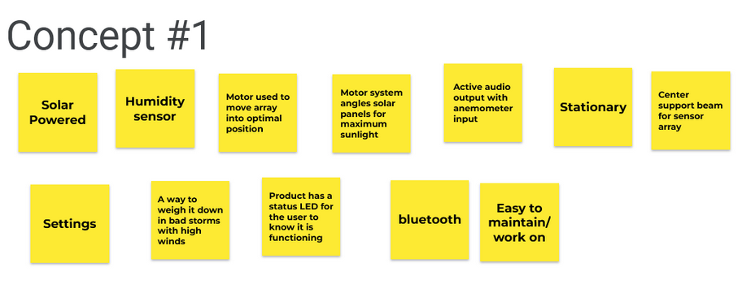
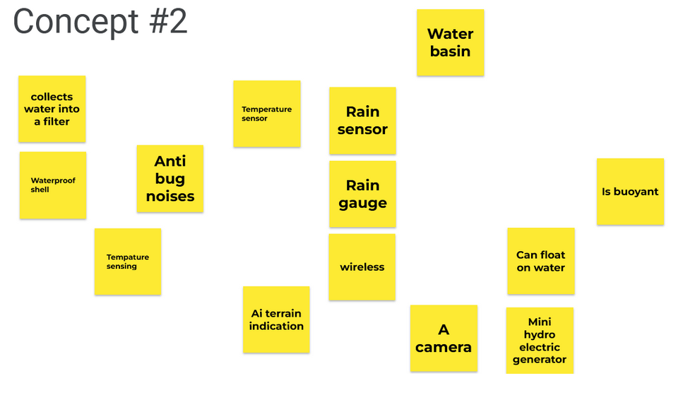
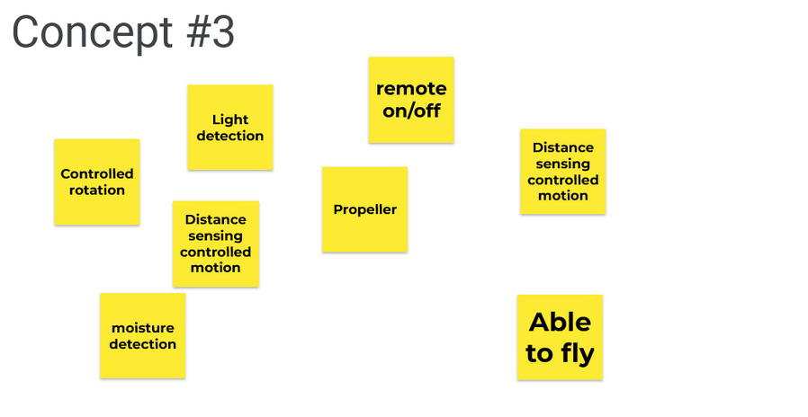
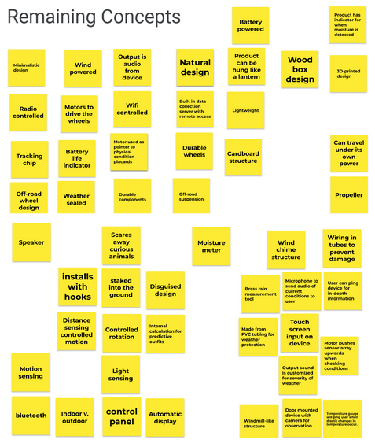
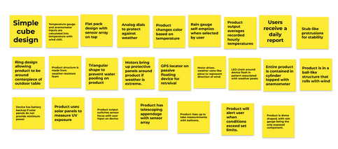

<b><h>Design Ideation</h></b>
  
  
<ul>
  <li>The way that our team organized, combined, and split needs into a list was based on basic categories such as hardware, software, user interactivity, safety, and desires.</li> 
  
  <li>Each team member came up with several ideas and concepts which could be used to meet the project requirements.</li> 

  <li>The type of brainstorming that worked was having everyone add all of their separate ideas on the jamboard and organizing them appropriately. What didn’t work was having everyone do them at the same time, this is due to the amount of similar or exact same concepts that were generated.</li> 

  <li>The process for organizing and ranking ideas was to see which ideas met the exact project requirements highest and then go through the rest of the ideas to rank them. Andrew came up with the all-terrain robot which has a flower design, Jeff came up with the boat which would be used to monitor storms in the ocean, and Marla came up with the helicopter which would be able to avoid obstacles.</li> 
</ul>

The type of brainstorming that worked was having everyone add all of their separate ideas on the jamboard and organizing them appropriately. What didn’t work was having everyone do them at the same time, this is due to the amount of similar or exact same concepts that were generated. 
The process for organizing and ranking ideas was to see which ideas met the exact project requirements highest and then go through the rest of the ideas to rank them. Andrew came up with the all-terrain robot which has a flower design, Jeff came up with the boat which would be used to monitor storms in the ocean, and Marla came up with the helicopter which would be able to avoid obstacles. 

  
<b>Generate Ideas</b>
 
The team was tasked with creating ideas of how our project could work. The images below are the ideas generated with this project in mind. No ideas were put down, so each member was tasked with creating as many ideas as possible knowing that each had to come up with 25, or so, ideas to meet the group quota. The group used Google Jamboard to remotely collaborate on these ideas.
  

 

 

 
<b>Organize & Group</b>
 
From the 100 generated topics, three project concepts were created. Below are the groups of ideas that fit these concepts. The concepts are detailed in a later section of this document.
  

 

 

 
The remaining concepts are detailed below. These ideas weren’t bad, but did not fit into the concepts created for this class

  

 

 
