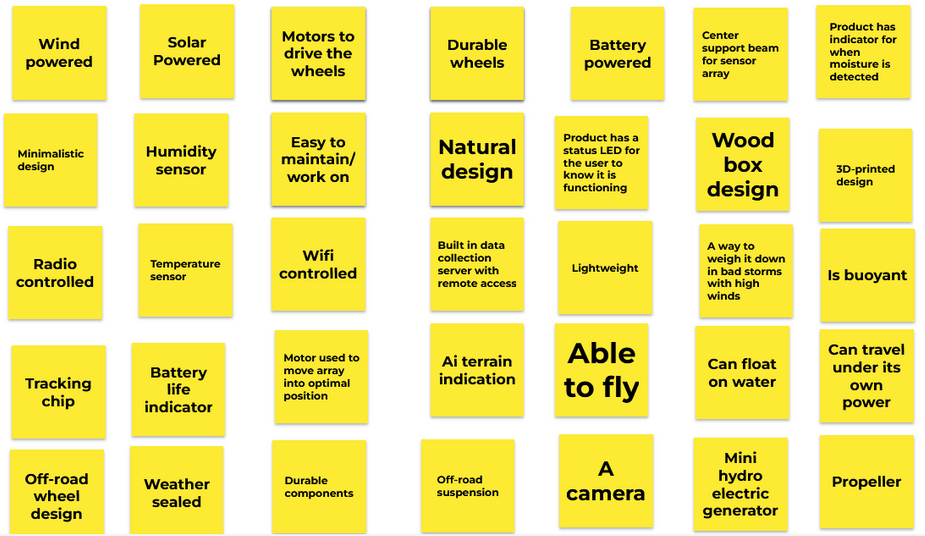
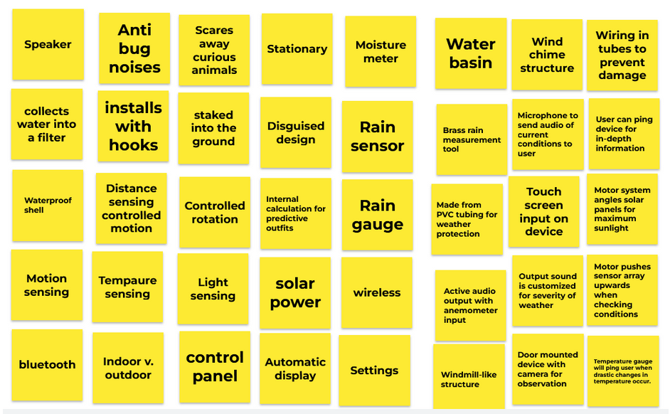
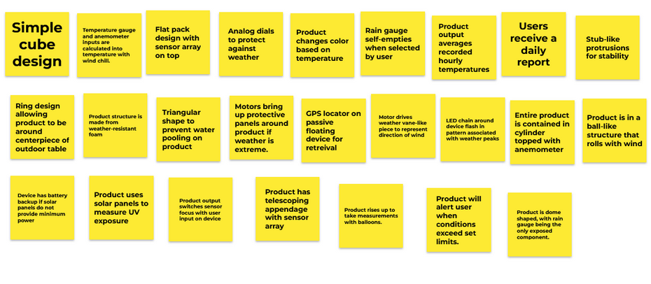

<b><h>Design Ideation</h></b>
  
<b>Generate Ideas</b>
 
The team was tasked with creating ideas of how our project could work. The images below are the ideas generated with this project in mind. No ideas were put down, so each member was tasked with creating as many ideas as possible knowing that each had to come up with 25, or so, ideas to meet the group quota. The group used Google Jamboard to remotely collaborate on these ideas.
  

 

 

 
<b>Organize & Group</b>
 
From the 100 generated topics, three project concepts were created. Below are the groups of ideas that fit these concepts. The concepts are detailed in a later section of this document.
 
 
The remaining concepts are detailed below. These ideas weren’t bad, but did not fit into the concepts created for this class

