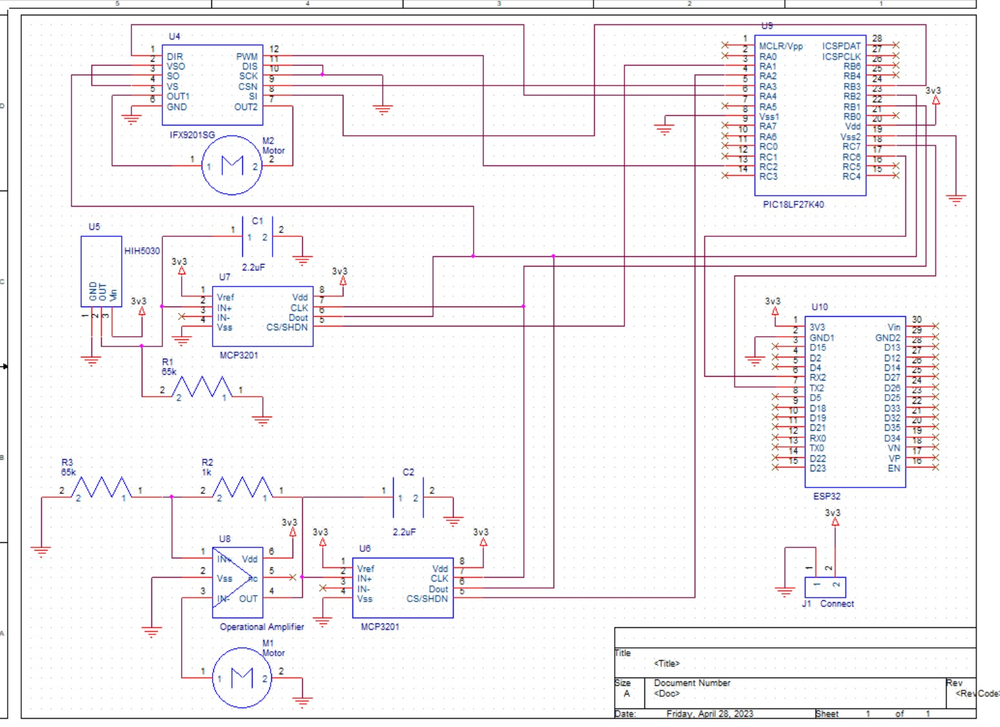

<h1><b>Hardware Proposal</b></h1>
An in-depth analysis of a hardware proposal's functionality is necessary to make sure that it fits user needs. When evaluating the suitability of our hardware proposal for its intended application and satisfies the expectations of its users, a thorough examination was done. To do this, the team considred mutilple kew points such as putpose, perforance, usability and compatibiltiy. The team was able to better grasp how a hardware proposal fits user wants and product requirements through its functioning by taking into account these elements. 

 

  

 

