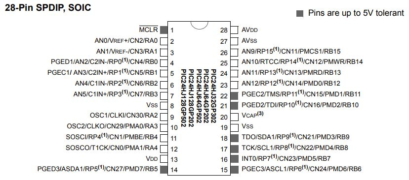
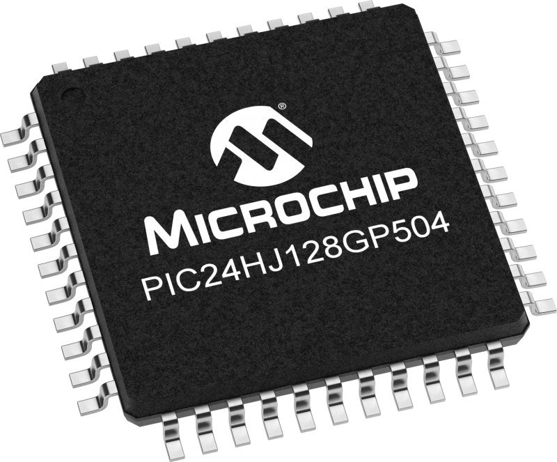

<h1><b>Microcontroller Selection</b></h1>

<table>
<colgroup>
<col style="width: 35%" />
<col style="width: 35%" />
<col style="width: 25%" />
</colgroup>
<thead>

<table>
<colgroup>
<col style="width: 25%" />
<col style="width: 25%" />
<col style="width: 10%" />
<col style="width: 10%" />
<col style="width: 10%" />
</colgroup>
<thead>
<tr class="header">
<th colspan="2"><strong>1. Determine your project-specific requirements</strong></th>
<th colspan="3"><strong>3. Look up specifications in the PIC datasheet</strong></th>
</tr>
<tr class="odd">
<th><strong>Design Considerations</strong></th>
<th>
<strong>Team Project-Specific Requirements</strong>

from Problem Definition and Block Diagram
</th>
<th><strong>PIC Option 1</strong></th>
<th><strong>PIC Option 2</strong></th>
<th><strong>PIC Option 3</strong></th>
</tr>
<tr class="header">
<th>How many GPIO Pins?<a href="#fn1" class="footnote-ref" id="fnref1" role="doc-noteref">1</a></th>
<th></th>
<th><strong>68</strong></th>
<th><strong>35</strong></th>
<th><strong>20</strong></th>
</tr>
<tr class="odd">
<th>Built-in Analog to Digital Converter? How many?</th>
<th></th>
<th><strong>1</strong></th>
<th><strong>1</strong></th>
<th><strong>2</strong></th>
</tr>
<tr class="header">
<th>Built-in Hardware PWM? How many?</th>
<th></th>
<th><strong>5</strong></th>
<th><strong>4</strong></th>
<th><strong>3</strong></th>
</tr>
<tr class="odd">
<th>Built-in I2C? SPI? How many?</th>
<th></th>
<th><strong>1 SPI  1 I2C</strong></th>
<th><strong>2 SPI  1 I2C</strong></th>
<th>
<strong>2 SPI  1 I2C</strong>

</tr>
<tr class="header">
<th>Built-in UART? How many?</th>
<th></th>
<th><strong>2</strong></th>
<th><strong>2</strong></th>
<th><strong>3</strong></th>
</tr>
<tr class="odd">
<th>Other Required Built-In Features? <em>(optional)</em></th>
<th></th>
<th></th>
<th></th>
<th></th>
</tr>
<tr class="header">
<th>Additional considerations specific to your project specifications <em>(optional)</em></th>
<th></th>
<th></th>
<th></th>
<th></th>
</tr>
<tr class="odd">
<th colspan="2"><strong>2. Find 3 microcontrollers that meet your team project-specific requirements and find information on each</strong></th>
<th colspan="3"><strong>4. Look up part details in the PIC datasheet</strong></th>
</tr>
<tr class="header">
<th><strong>Microcontroller Considerations</strong></th>
<th><strong>Instructions</strong></th>
<th><strong>PIC Option 1</strong></th>
<th><strong>PIC Option 2</strong></th>
<th><strong>PIC Option 3</strong></th>
</tr>
<tr class="odd">
<th>Part Number<a href="#fn2" class="footnote-ref" id="fnref2" role="doc-noteref">2</a></th>
<th><em>Include the entire part number (leave off any letters at the end that specify the package type)</em></th>
<th><strong>PIC18F8720</strong></th>
<th><strong>PIC24HJ128GP504 </strong></th>
<th><strong>PIC18F04Q40</strong></th>
</tr>
<tr class="header">
<th>Link (URL) to product page</th>
<th><em>Do not paste links directly into the table. Instead, <a href="http://www.microchip.com/"><u>link them like this</u></a>.</em></th>
<th><a href="https://www.microchip.com/en-us/product/PIC18F8720#"><strong><u>Product</u></strong></a></th>
<th><a href="https://www.microchip.com/en-us/product/PIC24HJ128GP504"><strong><u>Product</u></strong></a></th>
<th><a href="https://www.microchip.com/en-us/product/PIC18F04Q40"><strong><u>Product</u></strong></a></th>
</tr>
<tr class="odd">
<th>Links (URL) to Data Sheets</th>
<th></th>
<th><a href="https://ww1.microchip.com/downloads/aemDocuments/documents/MCU08/ProductDocuments/DataSheets/39609C.pdf"><strong><u>Data</u></strong></a></th>
<th><a href="https://ww1.microchip.com/downloads/en/DeviceDoc/70293G.pdf"><strong><u>Data</u></strong></a></th>
<th><a href="https://ww1.microchip.com/downloads/aemDocuments/documents/MCU08/ProductDocuments/DataSheets/PIC18F04-05-14-15Q40-Data-Sheet-40002236C.pdf"><strong><u>Data</u></strong></a></th>
</tr>
<tr class="header">
<th>Links (URL) to Application Notes</th>
<th><em>Often provided by manufacturers to give you specific examples of how to use their products. Search for them in the search bar on the Microchip’s website.</em></th>
<th>
<a 
<th><strong> N/A
(Not present on website)</strong></th>
<th><strong> N/A
(Not present on website)</strong></th>
<th>
<strong> N/A
(Not present on website)</strong>

<strong>found</strong>
</th>
</tr>
<tr class="odd">
<th>Links (URL) to Code Examples</th>
<th></th>
<th><a href="https://ww1.microchip.com/downloads/en/DeviceDoc/CE211_Ext_Int_14aug09r.zip"><strong><u>Code</u></strong></a></th>
<th><a href="https://ww1.microchip.com/downloads/en/DeviceDoc/ce484_pwm_oc_ptg.zip"><strong><u>Code</u></strong></a></th>
<th><a href="https://ww1.microchip.com/downloads/en/DeviceDoc/ce484_pwm_oc_ptg.zip"><strong><u>Code Page 166</u></strong></a></th>
</tr>
<tr class="header">
<th>Links (URL) to External Resources</th>
<th><em>Search on Google and YouTube for other resources for each specific microcontroller.</em></th>
<th><a href="https://www.youtube.com/watch?v=Yau9jtRrUHk"><strong><u>Signal Receiver</u></strong></a></th>
<th><a href="https://www.youtube.com/watch?v=FR84cNulIGs"><strong><u>Resources</u></strong></a></th>
<th><a href="https://www.youtube.com/watch?v=QQd9W5SnXFM"><strong><u>Resources</u></strong></a></th>
</tr>
<tr class="odd">
<th>Production Unit Cost</th>
<th><em>Find in the Microchip online store, or Digikey</em></th>
<th><strong>$11.84</strong></th>
<th><strong>$7.81</strong></th>
<th><strong>$1.16</strong></th>
</tr>
<tr class="header">
<th>Supply Voltage Range</th>
<th><em>Find in the microcontroller datasheet</em></th>
<th><strong>4.2-5.5V</strong></th>
<th><strong>3-3.6v</strong></th>
<th><strong>1.8-5.5V</strong></th>
</tr>
<tr class="odd">
<th>Absolute Maximum Current for entire IC</th>
<th><em>Find in the microcontroller datasheet</em></th>
<th><strong>3200mA</strong></th>
<th><strong>70mA</strong></th>
<th><strong>100mA</strong></th>
</tr>
<tr class="header">
<th>Maximum GPIO Pin Current (Source/Sink)</th>
<th><em>Find in the microcontroller datasheet</em></th>
<th><strong>25mA</strong></th>
<th><strong>8mA</strong></th>
<th><strong>25mA</strong></th>
</tr>
<tr class="odd">
<th>8-bit or 16-bit Architecture</th>
<th><em>Find in the microcontroller datasheet</em></th>
<th><strong>8-bit</strong></th>
<th><strong>16-bit</strong></th>
<th><strong>16-bit</strong></th>
</tr>
<tr class="header">
<th>Available IC Packages / Footprints</th>
<th><em>Find in the microcontroller datasheet. Choose a microcontroller with both surface mount and DIP/through-hole packages available. See Most Common Mistakes below for requirements to improve manufacturing reliability.</em></th>

<th><strong>Surface Mount</strong></th>
<th><strong>Surface Mount</strong></th>
<th><strong>Surface Mount</strong></th>

<tr class="odd">
<th>Supports External Interrupts?</th>
<th><em>Find in the microcontroller datasheet</em></th>
<th><strong>Supports 4 Pins</strong></th>
<th><strong>Supports 3 Pins</strong></th>
<th><strong>Supports 3 Pins</strong></th>
</tr>
<tr class="header">
<th>In-System Programming Capability and Type</th>
<th><em>Allows for programming the microcontroller without removing it from the PCB. Find in the microcontroller datasheet.</em></th>
<th><strong> Flash from PCB</strong></th>
<th><strong> Flash from PCB</strong></th>
<th><strong> Flash from PCB</strong></th>
</tr>
<tr class="odd">
<th>Programming Hardware, Cost, and URL</th>
<th><em>Find on the microcontroller product page</em></th>
<th>
<a href="https://ww1.microchip.com/downloads/en/DeviceDoc/39583c.pdf"><strong><u>Hardware</u></strong></a>

<th>
<a href="https://ww1.microchip.com/downloads/en/DeviceDoc/39583c.pdf"><strong><u>Hardware</u></strong></a>

<th>
<a href="https://ww1.microchip.com/downloads/en/DeviceDoc/39583c.pdf"><strong><u>Hardware</u></strong></a>

</tr>
<tr class="header">
<th>Works with <a href="https://www.microchip.com/mplab/mplab-x-ide"><u>MPLAB® X Integrated Development Environment</u></a> (IDE)?</th>
<th><em>Required. See <a href="https://www.microchip.com/development-tools"><u>Microchip Development Tools</u></a></em></th>
<th><strong>Yes</strong></th>
<th><strong>Yes</strong></th>
<th><strong>Yes</strong></th>
</tr>
<tr class="odd">
<th>Works with <a href="https://www.microchip.com/mplab/mplab-code-configurator"><u>Microchip Code Configurator</u></a>?</th>
<th><em>Required. Go to the <a href="https://www.microchip.com/en-us/tools-resources/configure/mplab-code-configurator"><u>MCC website</u></a>, click the “Manual Downloads” tab, scroll to the device library that goes with the PIC you chose (likely “MCC 8-bit PIC”) and read the release notes to make sure your microcontroller is in the list of supported devices.</em></th>
<th><strong>No</strong></th>
<th><strong>Yes</strong></th>
<th><strong>Yes</strong></th>
</tr>
</thead>
<tbody>
</tbody>
</table>
<section class="footnotes footnotes-end-of-document" role="doc-endnotes">

<ol>
<li id="fn1" role="doc-endnote">
No PIC16F887, PIC16F917, PIC18F47Q10, or dsPICs allowed
</li>
</ol>
</section>

<table>
<colgroup>
<col style="width: 25%" />
<col style="width: 25%" />
<col style="width: 15%" />
<col style="width: 15%" />
<col style="width: 15%" />
</colgroup>
<thead>
<tr class="header">
<th colspan="5"><strong>5. Write overall pros, cons, and rankings for the chosen microcontrollers</strong></th>
</tr>
<tr class="odd">
<th><strong>Overall Pros</strong></th>
<th><em>Write at least 2 for each microcontroller</em></th>
<th>
<strong>1)  Higher maximum current limits.</strong>

<strong>2) Supports more GPI/O and PWM pins</strong>
</th>
<th>
<strong>1) Cheaper</strong>

<strong>2) Supports Microchip Code Configurator.</strong>
</th>

<strong>3)Operating voltage is around expected sensor supply voltage </strong>
</th>
<th>
<strong>1)Low power consumption</strong>

<strong>2)Large memory</strong>

<strong>3)High processing speed </strong>
</th>

<strong>4)Has enhanced peripherals </strong>
</th>
</tr>
<tr class="header">
<th><strong>Overall Cons</strong></th>
<th><em>Write at least 2 for each microcontroller</em></th>
<th>
<strong>1)  Not supported by Microchip Code Configurator</strong>

<strong>2) Almost no online documentation</strong>
</th>
<th>
<strong>1) Very low current limits</strong>

<strong>2) Slower than other microcontrollers (40 MIPs) </strong>
</th>
<th>
<strong>1) Limited support for third party tools</strong>

<strong>2) Limited number of pins</strong>
</th>

<strong>2) Complex development environment</strong>
</th>

</tr>
<tr class="odd">
<th><strong>Ranking</strong></th>
<th><em>1 = first, 2 = second, 3 = third</em></th>
<th><strong>2</strong></th>
<th><strong>1</strong></th>
<th><strong>3</strong></th>
</tr>
</thead>
<tbody>
</tbody>
</table>

** Final Microcontroller Choice**: PIC24HJ128GP504-I/PT

Rationale: We will be using the PIC24HJ128GP504-I/PT as it has ESP32 along with SPI support. It also has all the I/O and PWM pins that we will be needing for our project. Alongside with this, it was one of the few microcontrollers that the team was able to find that will be able to ship and arrive in time. All other microcontrollers needed months to be shipped.
 
  

 
  

 

