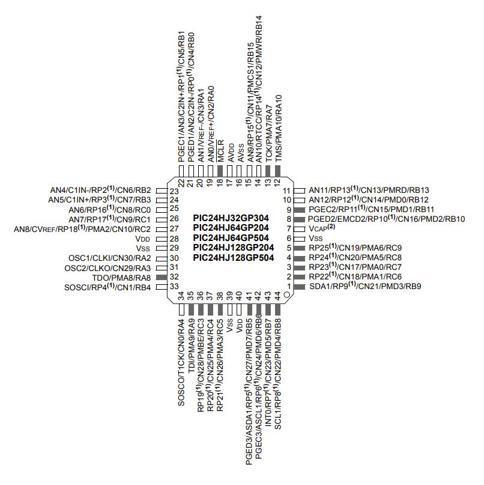

<h1><b>Microcontroller Selection</b></h1>
 
<h2><b>PIC24HJ128GP504-I/PT</b></h2>

 
Rationale: We will be using the PIC24HJ128GP504-I/PT as it has ESP32 along with SPI support. It also has all the I/O and PWM pins that we will be needing for our project. Alongside with this, it was one of the few microcontrollers that the team was able to find that will be able to ship and arrive in time. All other microcontrollers needed months to be shipped.
 
  

 
  

 

