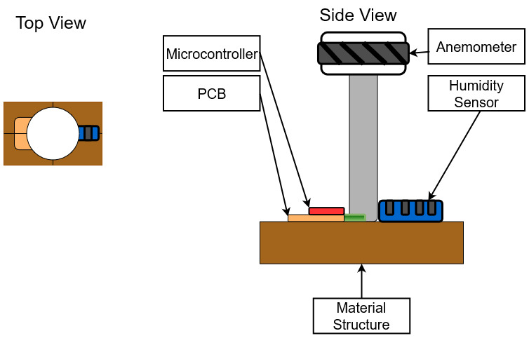

<h1><b>Selected Design</b></h1>
 

Our team had originally chosen design 1 due to it's simple layout and use of solar panels. The assumption was that having an auxillary power source will improve the overall complexity of the design and make the system more interesting. However, the team soon found that the addition of solar panel would require the addition of many additional components such as diodes and voltage regulators. After consulting with the teaching staff, the team decided to remove the solar panels from the design. Attached below is a diagram of our current selected design.
  

 
