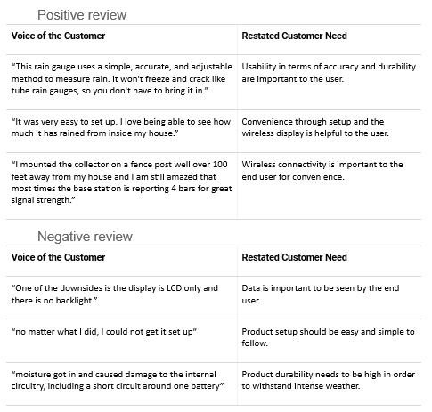

<h1><b>User Needs</b></h1>
 
<b>Introduction</b>
  
This document serves as the holder for research and organization of user requirements. The team has done research with the final project and users in mind. This will serve as the voice of the customer and will dictate how Team 308 will plan their project. Since the class will not have much contact with any hypothetical customers, the team will gather what they like and need in a solar powered outdoor data collector and safety regulations on it. From this the team will develop the requirements for the project, and carry these in mind instead of being in contact with a target audience.
  
<ul>
  <li>The way that our team organized, combined, and split needs into a list was based on basic categories such as hardware, software, user interactivity, safety, and desires.</li> 
  
  The way that our team assigned the weight of a user needs importance was by seeing which user needs were brought up most frequently in each category. 

  Our team changed the user needs into specifications by seeing which user needs were the most important and abundant and changing those into specifications. 

  Our team's project will be designed around all of the specifications which were needed as well as all used needs which have been shown to be the most important. 
</ul>
  
<b>Voice of the Customer Benchmarking</b>
  
This is the research for products already on the market. For each at least one positive and negative comment will be taken and analyzed. User needs will be brought from the comments. Below is that process with five products on the market today.

  

 

 
  

 

 
  

 

 
  

 

 
  

 

 

  
<b>Organize</b>
  
The team initially took all the comments gathered from the separate products and put them into a Google Jamboard (See screenshot below) looking at all of the needs, five categories were found to sort them into: hardware, software, user interaction, safety, and user desires. Although some needs could fit into two, or more, categories, all but two were eventually fitted into categories.
  

  

The five categories, as mentioned before, are hardware, software, user interaction, safety, and user desires. Hardware being the electrical components inside and how they are put together. This includes soldering, component selection, pcb manufacturing, and buttons. Outer shells, any paint, or any cosmetic features will not be included in this category. Software being the inevitable coding involved with this project. This category includes all the internal calculations that are needed and the outputs given to the hardware. User interaction includes the parts that the user will use to use the final design. Safety includes things such as the outer shell, the interaction with weather, and any interaction from the user to the electronics. User desires is a miscellaneous category of requirements that couldn’t fit into any categories, but are still important.
  

  
Next the category requirements were ranked. In each category, requirements were ranked/ ordered by how critical they were to the requirements. 
 

  

<b>Developing Requirements</b>
  
<b>Objectives</b>
  
Weather stations are used to gauge and electronically document the current weather conditions. This includes factors such as humidity, temperature, wind speed, and sun coverage. As people find themselves in a world with drastic weather, they will desire a way to personally check the conditions around them.
Our project seeks to construct a mobile weather station which will collect weather data using digital sensors. This data will be analyzed by the product in order to activate a mechanical output. The current project designs use a motor as the output. The product will be powered by an on-board power supply, such as batteries or a solar cell. We seek for the product to transmit collected data to wireless devices held by the user in an easily accessible format.
  
<b>Stakeholders</b>
  
Target group: People who desire accurate weather conditions quickly. They do not need much technical knowledge. 
Target purchaser: Target group profiles are individuals with residences where weather conditions are extreme or constantly changing. 
Customer service: Customers prefer products that are easy to set up and use. Repairs should be easily obtainable and expedient. 
Marketing & Sales division: Looks for people desiring a way to obtain weather conditions. 
Senior Management: Product must achieve the needed goals while satisfying set technical requirements. 
Retailers: Prefer products that can be used by the average consumer due to simplistic design and size. The product must be durable for a multitude of conditions and have longevity. 
Regulatory instances: The product needs to comply with US safety regulations as well as the requirements of Arizona State University. 

  
<b>Use Cases</b>
  
User Story #1: John 
John is a 43 year old male who lives with his family in a wooded area. Their family has a large yard where they like to participate in outdoor activities. Unfortunately, they have drastic weather changes that tend to dampen the mood. John wants a way to monitor the outside environment from the comfort of his home. The product by team 308 was exactly what he was looking for, as the device was easy to set up and self-powered. John placed the product on his porch and linked it wirelessly to his phone. As such, he can now see the current weather around his home instantly from his phone.
  
User Story #2: Mark 
Alice is a 30 year old female who lives in an apartment. She has an outdoor patio where she likes to relax. For that, she has placed furniture and small mats along the patio. However, she has experienced difficulty with frequent wind covering her chairs in dirt. She wants a product that would allow her to monitor the outdoor conditions in her patio. If the recorded wind is much higher than usual, she will know to bring in her furniture. She purchased the product and found it to be exactly what she wanted. She liked the simplicity of the device and the fact that it sent information to her wireless devices.
