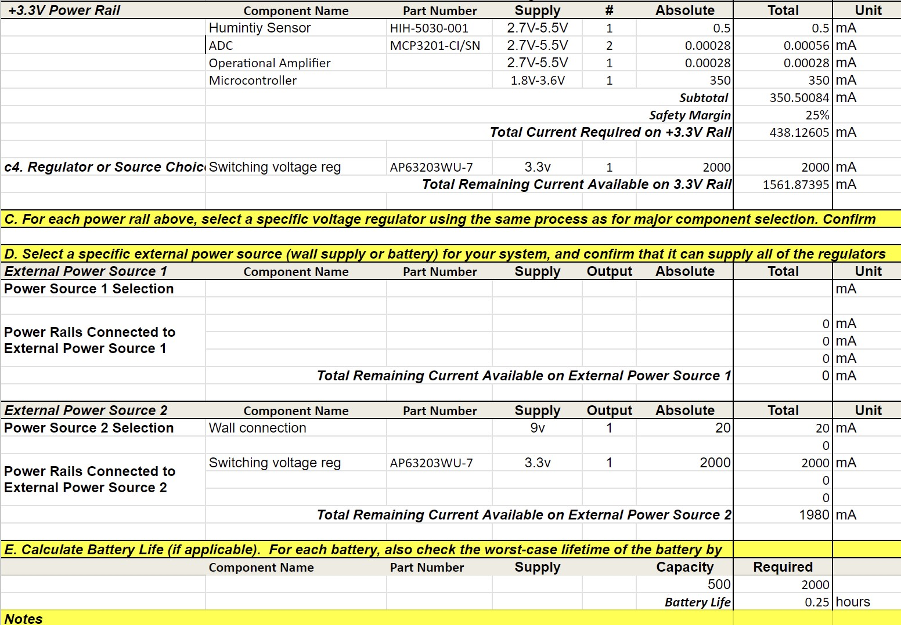
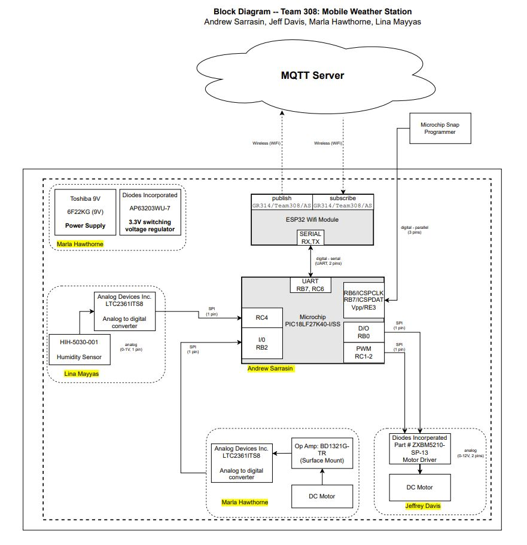

<h1 style="text-align: center;">Mobile Weather Station Project</h1>
<h2 style="text-align: center;">Team 308</h2>

Marla Hawthorne, Andrew Sarrasin, Lina Mayyas, Jeffrey Davis

<h2 style="text-align: center;">Arizona State University - Travis Kelley (EGR 314)</h2>

<h2>Table of Contents</h2>
<ul>
<a href="https://egr314-team308.github.io/#team-organization"><u>1. Team Organization</u></a> 
<a href="https://egr314-team308.github.io/#user-needs-benchmarking-and-requirements"><u>2. User Needs, Benchmarking, and Requirements</u></a> 
<a href="https://egr314-team308.github.io/#design-ideation"><u>3. Design Ideation</u></a> 
<a href="https://egr314-team308.github.io/#design-ideation"><u>4. Selected Design</u></a> 
<a href="https://egr314-team308.github.io/#block-diagram"><u>5. Block Diagram</u></a> 
<a href="https://egr314-team308.github.io/#component-selection"><u>6. Component Selection</u></a> 
<a href="https://egr314-team308.github.io/#microcontroller-selection"><u>7. Microcontroller Selection</u></a> 
<a href="https://egr314-team308.github.io/#software-implementation"><u>8. Software Implementation</u></a> 
<a href="https://egr314-team308.github.io/#hardware-implementation"><u>9. Hardware Implementation</u></a> 
<a href="https://egr314-team308.github.io/#presentation"><u>10. Presentation</u></a> 
<a href="https://egr314-team308.github.io/#system-verification"><u>11. System Verification</u></a> 
<a href="https://egr314-team308.github.io/#lessons-learned"><u>12. Lessons Learned</u></a> 
<a href="https://egr314-team308.github.io/#recommendations-for-future-students"><u>13. Recommendations for Future Students</u></a> 
</ul>

 

<h2>Table of Figures</h2>
<li></li>
<li></li>
<li></li>
<li></li>
<li></li>
   
 
 
 
<h3>Introduction</h3>
   The goal of this project is to navigate the process of creating systems for serial sensing for a variety of uses for robotics and many others. A responsive system will be created and fabricated to be able to adapt to its environement. By the utilization of sensors, control algorithims, and actuators, an increase of effectives and efficiency will occur. The ultimate goal is to design a system with the ability to detect and respond to changes within the environement. 

  A multidisciplinary approach will be used to provide success in this project, which will combine the knowledge and aspects of both Robotic and Electrical Engineering . The ultimate objective is to develop an intelligent system that will have the ability to enhance human interaction with the environment and pave the way for a more sustainable future. 
  
<h4>Team Charter</h4>
  
<b>Team 308 would like to be successful in EGR 314 by participating in the design process and
constructing a product that meets the given criteria. This entails the finished product being evaluated
and graded by the instructor and the teaching team. A successful product would result in an
acceptable grade for the group. The team would also like to be successful by learning new skills in
hardware and software. This will be accomplished by interacting with each other and communicating
with the instructor and teaching staff. In summary, Team 308 would like to complete the goals listed
below:
<li>1. Perform well academically in EGR 314
<li>2. Create a product that successfully functions as a mobile weather station
<li>3. Have each team member learn new skills in hardware and software
<li>4. Interact with other teams in order to learn new methods and suggestions
<li>5. Design and construct a product that can be added to each team member’s portfolio of
engineering experience
   
<h4>Mission Statement</h4>
<b> Team 308 seeks to design and construct a product that functions as a mobile weather station. The
goal is for the product to efficiently collect and transmit data from digital sensors through wireless
connections. We will be successful when the product can be utilized to accurately and easily collect
sensor outputs relating to immediate weather conditions.</b>
   
 

 

<h3><a href="https://egr314-team308.github.io/TeamOrganization.html"><u>Team Organization</u></a></h3>

Our team first evaluated the needs of the project and assessed the syllabus to consider academic points that will need to be touched base this semester. It is incredibly important that every team member is aware of the requirements of this courses expectations. Therefore, a list of five different team charter points was created to focus on during the semester. Each point ensures the success of each team memeber in this course along with the success as a team. As a team, following these team charter points is very beneficial to the quality and achievement of our course project. We have a set goal that we will work on achieving thorught the semester by implementing our team charter onto our weather monitoring system. The teams main goal is to use our skills and knowledge and implement it into our project. 

 

<h3><a href="https://egr314-team308.github.io/UserNeeds.html"><u>User Needs, Benchmarking, and Requirements</u></a></h3>

After careful consideration of our mission statement and charter, we later moved onto laying out potential user needs and requirements that are needed to the prototype. To create user needs, we used existing customer comments to similiar products to capture thier needs and recognize solutions to thier issues. This allowed us to create the most precise user needs and solutions to create a product that serves customer satisfaction and user friendliness. The user needs collected and created were then organized and tranferred into a clear list that will be focused on thorught the creation of this project. By doing this, it allows us to use engineering skills to enable these needs within our prototype. 
 
  

<h3><a href="https://egr314-team308.github.io/DesignIdeation.html"><u>Design Ideation</u></a></h3>

After creating a list of user needs and requirements, we created three designs for consideration for the final prototype. Each team member proposed ideas in a general basis and as a team, we created three different ideas that this project could be based off of. Brainstorming together as a team was very beneficial as it inspired new ideas and some designs that were created were combinations of two different ideas. As a team, we were then able to protoype complete draft designs that fit the needs of the project requirement and are possible candidates for a final design concept that will be implemented into a physical protoype by the end of this semester. 

 

<h3><a href="https://egr314-team308.github.io/SelectedDesign.html"><u>Selected Design</u></a></h3>

On choosing a design for our project, our team worked together. With our ideation sessions, we started by thinking and producing a range of design choices. Next, after carefully examining each design, we chose the best one based on its advantages, how well it satisfied the project's criteria, and whether it was within the allotted budget. We gathered the opinions of every team member before making a decision, allowing us to take into account all viewpoints and insights. By involving the whole team in this process, we made sure that everyone had a say and that everyone supported the final design. In the end, we are convinced that the design we have selected will be successful in accomplishing the project's goals.

 

<h3><a href="https://egr314-team308.github.io/BlockDiagram.html"><u>Block Diagram</u></a></h3>

The block diagram is an essential component that will graphically represent the key elements of each subsystem and show how they will work together to create the finished result. This thorough strategy will act as the framework for our project, clearly and succinctly laying out how the work and components will be distributed. We will give a thorough overview of the product, displaying how each component works into the bigger system as well as highlighting its features and potential. With the use of our block diagram, which will be a crucial presentation tool, we will be able to show how each subsystem works in concert with the others to accomplish a shared objective. 

 

<h3><a href="https://egr314-team308.github.io/CompSelectApp.html"><u>Component Selection</u></a></h3>

Our team had to carefully study and assess numerous important components for each subsystem as part of the component selection process. Our team chose the components with an uncompromising focus on quality, a sharp eye for detail, and a well-thought-out justification that guaranteed their ideal performance and compatibility with the system. It is important to note that the microcontroller selection procedure was carried out independently and will be covered in a separate section. 
These components are mostly set in stone. Each person in the group is free to choose another component as long as it is represented in the current documents. As the team sees it, this portion of the project is complete, because all persons on the team have made individual schematics and combined them into the hardware proposal.
 
In accordance to the formatting instructions given in the checkpoint assignments, the information detailing component selection is present in the associated subpage.   
  
   

 <h3>Power Budget:</h3>
   

This is the power budget for all of our main components It shows our device is to run for 160 hours on a 9 volt battery. Meaning we have about a week of runtime.

 

<h3><a href="https://egr314-team308.github.io/MicrocontrollerSelection.html"><u>Microcontroller Selection</u></a></h3>

The process of choosing the best microcontroller was a crucial part of our project, therefore our team had to be extremely attentive and diligent in their selection. We thoroughly and rigorously evaluated all of the solutions on the market, taking into account things like performance, power usage, cost, and system compatibility. After reducing the list of potential choices, our team settled on the microcontroller we think will provide the best performance and functionality for our project. This section offers a thorough and informative overview of our microcontroller selection procedure. 

 

<h3><a href="https://egr314-team308.github.io/HardwareProposal.html"><u>Hardware Implementation</u></a></h3>

The design and development of a hardware system that exemplifies the seamless integration of several components working together is part of our project proposal. Our system's electrical design is essential to ensuring that all the parts work together smoothly and efficiently. In order to create a completely functional and effective system, we want to show how various hardware elements, including  microcontrollers, sensors, actuators, and power sources, interact with one another. In addition to putting a strong emphasis on effective power management and signal processing, our design also takes reliability and safety into account. With this hardware design, we hope to offer a thorough and useful solution that can be used in a variety of industries, from automation to robotics and beyond.

 
   
<h3><a href="https://egr314-team308.github.io/SoftwareProposal.html"><u>Software Implementation</u></a></h3>

Our project proposal calls for the creation of a software proposal that will be in charge of directing and coordinating the various elements of our hardware system. The program will be created to operate on a microcontroller and be in charge of reading, analyzing, and utilising data from sensors to control different actuators in the system. Capabilities for error handling and debugging were also included to make sure the software can run consistently and effectively. The goal of this software proposal is to offer a complete solution that exemplifies the capability and adaptability of our microcontroller in managing and coordinating our hardware system.
   
   

    
   

 

<h3><a href="https://egr314-team308.github.io/Presentation1.html"><u>Presentation</u></a></h3>

Our team produced a professionally recorded video of our project presentation in order to give a thorough overview of the development of our project and the design procedures we used. This video serves as a helpful summary of our previous work, displaying the thorough and original methods we used to develop our designs. The presentation gives a thorough breakdown of every design element and how it was created by our team, showcasing our artistic vision and technical proficiency. By presenting our product in this manner, we hope to highlight the effort and commitment that went into its development while simultaneously giving readers a clear idea of its features and usefulness.
 
   
<h3><u>System Verification</u></h3>
   
   

   
 
   
<h3>Lessons Learned</h3>
   
1. Solder oven staions 
   Surface mount comonents are small and there is very little room on the footprints for error. using the solder paste and oven is safer and there is little risk for damaging the parts since the only heat comes from the oven where the tempature and exposure to heat is exact and timed.
   The throughhole componets (headers, wires, sockets, etc.) cannot go into the ovens, so the surface mount components must go first.
     
2. Serial Digital Communication 
   When working with many inputs at a time, mutiple clocks, MOSI, and MISO pins might not be avalible. Being able to turn off and on the subsystems to only communicate with one is helpful to use. The software and hardware have to be in working order to make this communication work.
   Many datasheets that explain hhow to efficiently use digital communication in the firmware, but knowing how to accomplish this consepually makes the process more streamlined.
      
3. Using Cadence 
   Cadence is a confusing software at first, but having knowlage about an industry professional software can be helpful. 
      
4. Ordering Excess Parts 
  The team learned that it is important to order plenty of parts to ensure that there is enough. This is so the team can still have enough parts in the event that a part doesn't work. Not having enough parts can delay the functionality of a subsystem and cause many issues. 
      
5. Quality Assurance 
   The group discovered how crucial it is to carry out thorough quality verification on the PCB before attaching any components to it. The team was able to find any flaws by doing a continuity check before they became major ones later on in the design phase. This made it easier to make sure the finished item was correctly designed and performed as anticipated.
      
6. Using 0-ohm resistors 
   The team learned that you can use 0-ohm resistors in order to make test       points on your PCB and this is crucial to make testing your board's           subsystems a streamlined process. 
      
7. Be sure to check the mounting option 
   When creating your PCB be sure to check what mounting option you select so    that you do not accidentally make a surface mount component a through-hole    one. 
      
8. Having an updated folder structure helps organize where everything is and    makes everything easily accessible 
   When creating the folder structure be sure to constantly update it so that    you do not fall behind and so that necessary files are available at all      times to every team member.
      
9. Following course requirements as they change or are adapted is very important 
   The group learned that you need to make sure you follow specific              requirements laid out in the rubric and continue to make sure that you        follow them all throughout the project. 
      
10. Make sure to restart the cadence software every so often in order to keep it from causing weird errors and crashing itself 
   The group realized that due to having cadence running almost 24/7 for around a month that it would start causing errors with the software and cause it to corrupt certain files. 

   
  
   
<h3>Recommendations for future students</h3>
   Here are some suggestions to assist students who are enrolled in EGR 314, an embedded system design course that requires them to develop a project for a mobile weather station:
 
      
1.  Getting Started Early: Embedded system design takes a lot of time and work. It is advised to begin the project as soon as possible, thoroughly comprehend the project's needs, develop the design, and order all essential parts. Starting early will also give you ample time to debug and address any problems that may come up while you are designing and testing.
    
      
  2.  If at all possible, avoid picking tiny project components since they are hard to handle and are more likely to cause mistakes. A preferable option is a component with leads or contact pads on the bottom. Before choosing which parts to use, it's crucial to make sure that all of the components share the same level of logic in order to prevent issues with integration.
   
      
3.       Learn the fundamentals of PCB design because this course requires you to create a PCB, thus you must be familiar with these ideas. Students might begin by becoming familiar with the various PCB parts, schematics, and designing tools. They can get started with the help of numerous online resources, tutorials, and videos.
 
      
4.           Work together as a team: Collaborating on a project as a team can be difficult yet vital. To keep everyone on the same page, students should organize regular meetings, distribute duties appropriately, and use good communication with their team members. For the project to be finished, cooperation is crucial.
    
      
5.   Ordering additional parts in plenty of quantity is advised. The rigorous hardware design and debugging required for the course increases the likelihood of component failure. By ordering extra components, you may cut down on the time, money, and delays that come with buying hardware.
   
   
    
6.    Early and frequent testing is essential to the design of embedded systems. Every step of the design process should include testing the PCB and subsystems created by the students. By doing this, they will be able to see any concerns early on and address them.
   
    
7.     Embedded system design may be complicated, and students may run into issues they are unable to resolve on their own. Don't be hesitant to ask for assistance. They shouldn't be embarrassed to approach their teacher or fellow students for assistance. They may offer insightful advice and recommendations that might support students in overcoming any challenges they may run across.
 
      
   Students can develop a useful mobile weather station and pass the course by adhering to these suggestions. It's crucial to retain an open mind, absorb lessons from errors, and find pleasure in the process.
   
    
 

<h2><a href="https://egr314-team308.github.io/Appendix.html"><u>Appendix A: Team Organization</u></a></h2>
